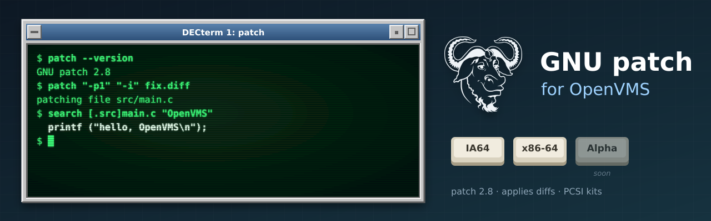

<p align="center">
  
</p>

# GNU patch for OpenVMS

[GNU patch](https://www.gnu.org/software/patch/) (**2.8**), which applies a diff to the
original files, built natively for OpenVMS on **IA64** and **x86-64**, following patch's own
releases. [GNU diffutils for OpenVMS](https://github.com/issinoho/vms-diffutils) makes the
diffs. It belongs to the same family as [GNU grep](https://github.com/issinoho/vms-grep),
[GNU sed](https://github.com/issinoho/vms-sed), [GNU awk](https://github.com/issinoho/vms-awk),
[GNU make](https://github.com/issinoho/vms-make), [GNU m4](https://github.com/issinoho/vms-m4),
[GNU Bison](https://github.com/issinoho/vms-bison), [flex](https://github.com/issinoho/vms-flex),
[GNU Wget](https://github.com/issinoho/vms-wget), [curl](https://github.com/issinoho/vms-curl),
[PCRE2](https://github.com/issinoho/vms-pcre2) and [zlib](https://github.com/issinoho/vms-zlib)
for OpenVMS.

This repository holds **only our changes**: every build starts from the signed GNU release
tarball (Andreas Gruenbacher's key, pinned in `keys/`), applies our patches and adds our VMS
files. As for grep, sed and m4, patch's own `configure` runs on a Linux host with every
compile and link test sent to VSI C on the node, and MMS builds the result.

## Status

**Released: [v2.8-vms1](https://github.com/issinoho/vms-patch/releases/tag/v2.8-vms1).**

| | IA64 (OpenVMS V8.4-2L3, VSI C 7.4) | x86-64 (OpenVMS E9.2-4, VSI C 7.7) |
|---|---|---|
| VSI C configure answers (identical on both) | yes | yes |
| Builds | yes | yes |
| Smoke test: unified and context diffs, `-R`, `-b` backups, `--dry-run`, a failing hunk (error status and `.rej`), `-p1` into a subdirectory, a missing patch file | 8/8 | 8/8 |
| Kit install, smoke test on the installed image, remove | clean | clean |
| PCSI kit (`PATCH`, `V2.8-0E1`) | `ISSINOHO-I64VMS-PATCH-V0208-0E1-1.PCSI` | `ISSINOHO-X86VMS-PATCH-V0208-0E1-1.PCSI` |

## Installing the kit

Download the kit for your architecture from the
[latest release](https://github.com/issinoho/vms-patch/releases/latest) and check it against
the release's `SHA256SUMS`. A kit downloaded through a non-VMS system loses its record
format, so restore that first, then install it:

```
$ SET FILE/ATTRIBUTE=(RFM:FIX,LRL:8192,MRS:8192,RAT:NONE) ISSINOHO-*-PATCH-V0208-0E1-1.PCSI
$ PRODUCT INSTALL PATCH /PRODUCER=ISSINOHO /SOURCE=dev:[dir]
$ @PATCH$ROOT:[000000]PATCH$SETUP.COM
$ patch "-p1" "-i" fix.diff
```

It installs `[PATCH.BIN]PATCH.EXE`, `PATCH$SETUP.COM` (defines the `patch` command), the
manual page (`PATCH.TXT`, `PATCH.1`), `NEWS`, `COPYING` and `README.VMS` in `[PATCH.DOC]`,
and `SYS$STARTUP:PATCH$STARTUP.COM`, which defines `PATCH$ROOT` (add it to
`SYS$MANAGER:SYSTARTUP_VMS.COM`). `PRODUCT REMOVE PATCH` removes it.

## On VMS

- **File names** in a diff are Unix-style and relative to the current directory:
  `src/main.c` is `[.SRC]MAIN.C`. Backups (`-b`) and rejects keep patch's Unix names,
  `main.c.orig` and `main.c.rej`, which need an ODS-5 disk.
- **Exit status.** Under DCL failed hunks (exit code 1) and trouble (2) are errors, so
  `ON ERROR` and `IF .NOT. $STATUS` work. Under a GNV shell, `$?` is the exit code as on
  Unix.
- **Not available:** ed-style diffs (`diff -e`), which patch applies by running the Unix
  `ed` editor, and getting files from RCS or SCCS before patching them.
- **Upper-case options in batch jobs.** Under the TRADITIONAL DCL parse style unquoted
  options reach patch in lower case: `-R` (reverse) becomes `-r` (reject file). Use the long
  options (`--reverse`), quote the short ones (`"-R"`), or
  `$ SET PROCESS/PARSE_STYLE=EXTENDED` first.

## Patches

| Patch | Purpose |
|---|---|
| 0001 | `lib/scratch_buffer.h`: include the generated `*.gl.h` header as `*_gl.h` (VSI C cannot include a name with two dots). |
| 0002 | `lib/getprogname.c`: VMS implementation. |
| 0003 | `lib/malloc/scratch_buffer.h`: avoid the member name `__align`, a VSI C keyword. |
| 0004 | `lib/stdlib.in.h`: route `exit()` through `vms_exit()` for an error-severity status under DCL. |
| 0005 | `config.hin`: let `<assert.h>` define `assert` again (VSI C's header guard). |
| 0006 | `src/safe.c`: no `getrlimit()` on VMS; a fixed size for the directory cache. |
| 0007 | `src/common.h`: `readonly` is a VSI C keyword; rename the identifier. |
| 0008 | `lib/open.c`: open a directory through gnulib's fallback. |
| 0009 | `src/patch.c`: plain file names (the `openat()` emulation failed to set the output file's mode; absolute names and `..` are still refused); the program name `patch` in messages. |

0001-0005 are the gnulib fixes of the m4, sed and Bison ports; 0008 is vms-grep's.

## How to build

Set up `tools/nodes.conf` as described in
[vms-grep's README](https://github.com/issinoho/vms-grep#2b-build-on-vms-from-the-host-over-ssh).

```sh
git clone https://github.com/issinoho/vms-patch.git
cd vms-patch
tools/vms_configure.sh ia64 # VSI C configure run, about an hour (once per release)
tools/prepare.sh            # fetch + verify, patch, configure with the VSI C answers, MMS lists
tools/build.sh ia64         # upload, then @[.VMS]BUILD on the node (MMS)
tools/test.sh ia64          # smoke test
tools/kit.sh ia64           # PCSI kit -> out/kits/
```

## Roadmap

1. patch's own test suite under GNV, as for grep and sed.
2. Offer patches 0006, 0007 and 0009 to GNU patch, and the gnulib fixes to gnulib.
3. A port to OpenVMS **Alpha**.

The family of ports, all for IA64 and x86-64, each following its upstream releases:

| Port | Latest release | |
|---|---|---|
| GNU grep — [vms-grep](https://github.com/issinoho/vms-grep) | [v3.12-vms3](https://github.com/issinoho/vms-grep/releases/tag/v3.12-vms3) | with `grep -P` through PCRE2 |
| PCRE2 — [vms-pcre2](https://github.com/issinoho/vms-pcre2) | [v10.49-vms1](https://github.com/issinoho/vms-pcre2/releases/tag/v10.49-vms1) | the regular-expression library |
| GNU sed — [vms-sed](https://github.com/issinoho/vms-sed) | [v4.10-vms1](https://github.com/issinoho/vms-sed/releases/tag/v4.10-vms1) | the stream editor |
| GNU awk (gawk) — [vms-awk](https://github.com/issinoho/vms-awk) | [v5.4.1-vms1](https://github.com/issinoho/vms-awk/releases/tag/v5.4.1-vms1) | built with gawk's own VMS port |
| zlib — [vms-zlib](https://github.com/issinoho/vms-zlib) | [v1.3.2-vms1](https://github.com/issinoho/vms-zlib/releases/tag/v1.3.2-vms1) | the compression library |
| curl — [vms-curl](https://github.com/issinoho/vms-curl) | [v8.22.0-vms1](https://github.com/issinoho/vms-curl/releases/tag/v8.22.0-vms1) | alongside VSI's curl kit, following curl's own releases |
| GNU Wget — [vms-wget](https://github.com/issinoho/vms-wget) | [v1.25.0-vms2](https://github.com/issinoho/vms-wget/releases/tag/v1.25.0-vms2) | the web retriever |
| GNU m4 — [vms-m4](https://github.com/issinoho/vms-m4) | [v1.4.21-vms1](https://github.com/issinoho/vms-m4/releases/tag/v1.4.21-vms1) | the macro processor |
| GNU Bison — [vms-bison](https://github.com/issinoho/vms-bison) | [v3.8.2-vms2](https://github.com/issinoho/vms-bison/releases/tag/v3.8.2-vms2) | the parser generator |
| flex — [vms-flex](https://github.com/issinoho/vms-flex) | [v2.6.4-vms1](https://github.com/issinoho/vms-flex/releases/tag/v2.6.4-vms1) | the scanner generator; runs GNU m4 |
| GNU make — [vms-make](https://github.com/issinoho/vms-make) | [v4.4.1-vms1](https://github.com/issinoho/vms-make/releases/tag/v4.4.1-vms1) | built with make's own VMS port |
| GNU diffutils — [vms-diffutils](https://github.com/issinoho/vms-diffutils) | [v3.12-vms1](https://github.com/issinoho/vms-diffutils/releases/tag/v3.12-vms1) | cmp, diff, diff3, sdiff |
| **GNU patch** (this port) — [vms-patch](https://github.com/issinoho/vms-patch) | [v2.8-vms1](https://github.com/issinoho/vms-patch/releases/tag/v2.8-vms1) | applies diffs |

## Artwork

`docs/images/banner.svg` and `docs/images/icon.svg` were made for this project in the style
of classic DECwindows and VT terminals, like those of its sibling ports. The GNU head is by
Aurelio A. Heckert, used under the terms on <https://www.gnu.org/graphics/heckert_gnu.html>.

## Licence

GNU patch is free software under the GNU General Public License, version 3 or later; see
`COPYING`. Our patches and VMS files are distributed under the same terms.

OpenVMS is a trademark of VMS Software, Inc. This project is not affiliated with VMS
Software, Inc. or with the GNU project.
